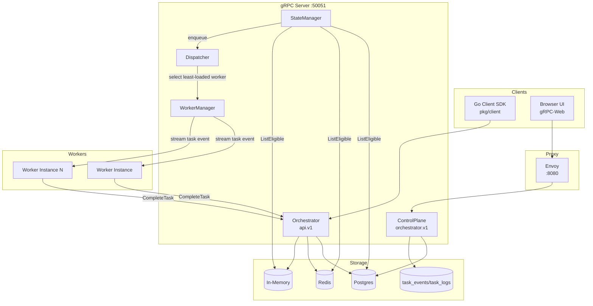
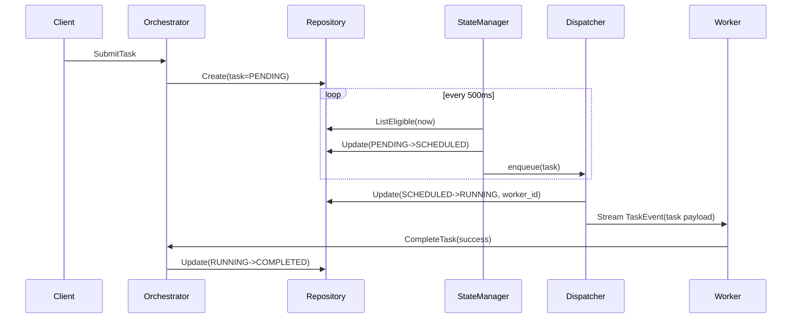
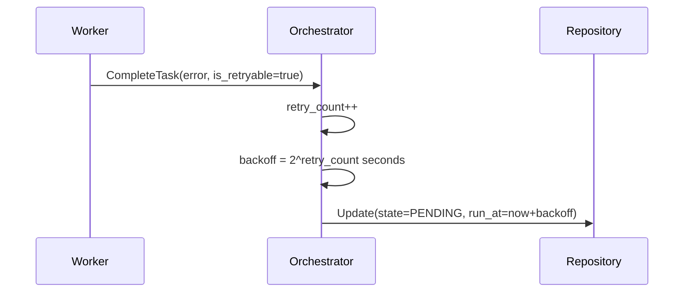
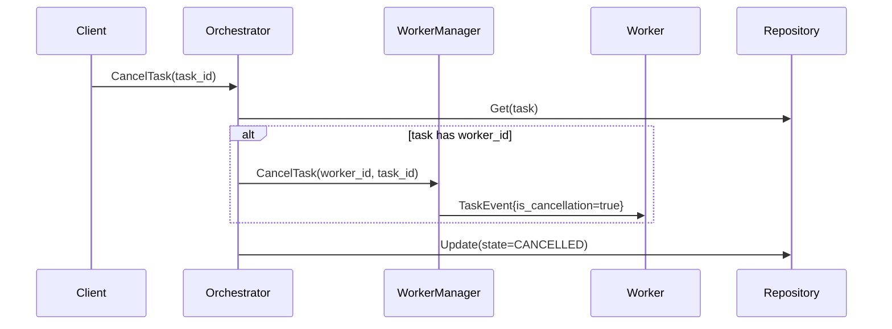

# System Architecture

This document explains how the orchestrator works internally, how data moves through the system, and which behaviors are guaranteed by the current implementation.

## 1. Design Goals

Primary goals:
- deterministic task state transitions,
- explicit task ownership by workers,
- support for retryable failures and cancellation,
- embeddable worker/client SDKs,
- pluggable persistence layer.

Non-goals (current implementation):
- strict multi-tenant isolation in storage,
- exactly-once execution guarantees,
- built-in dead-letter queues,
- historical event replay with resume tokens.

## 2. Topology

## 3. Core Components

### 3.1 `Orchestrator` service (`internal/service/orchestrator.go`)

Responsibilities:
- accept task submissions,
- maintain task state on completion/failure/cancel,
- send cancellation signals to workers,
- emit task state events via publisher.

Key details:
- `SubmitTask` validates `task_id` and `type`.
- `CancelTask` is idempotent for terminal tasks (returns success).
- `CompleteTask` handles retry/backoff or final failure.
- gRPC errors map from domain errors (`NotFound`, `FailedPrecondition`, `Internal`).

### 3.2 `StateManager` (`internal/service/state_manager.go`)

Responsibilities:
- periodic polling of eligible tasks,
- transition `PENDING -> SCHEDULED`,
- enqueue for dispatch.

Key details:
- polling interval is fixed at 500ms,
- batch size comes from server setup (`cmd/server/main.go`, default 10),
- only `PENDING` tasks with `run_at <= now` are considered eligible.

### 3.3 `Dispatcher` (`internal/service/dispatcher.go`)

Responsibilities:
- take tasks from queue,
- pick worker from `WorkerManager`,
- transition task `SCHEDULED -> RUNNING`,
- stream `TaskEvent` to worker.

Worker selection strategy:
- least-connections: worker with minimal active task count.

### 3.4 `WorkerManager` (`internal/service/worker_manager.go`)

Responsibilities:
- track connected workers and their active task counts,
- serialize stream writes per worker (`SafeStream` mutex),
- send task cancellation events,
- publish worker connect/disconnect events.

Key details:
- duplicate worker IDs are rejected,
- on worker disconnect, server calls repository `ReleaseTasks(worker_id)` to return owned tasks.

### 3.5 `ControlPlane` (`internal/service/control_plane_service.go`)

Responsibilities:
- task querying (`ListTasks`, `GetTask`),
- live event fanout (`StreamTaskEvents`),
- cluster stats (`GetClusterStats`),
- optional persistence of task events and logs in Postgres.

Current scope behavior:
- scope (`tenant_id`, `namespace_id`) is attached to responses/events,
- scope is currently not enforced in repository-level filtering.

## 4. Task State Machine

### 4.1 States

- `PENDING`
- `SCHEDULED`
- `RUNNING`
- `COMPLETED` (terminal)
- `FAILED` (terminal)
- `CANCELLED` (terminal)

### 4.2 Allowed transitions

| From | To |
|---|---|
| `PENDING` | `SCHEDULED`, `CANCELLED` |
| `SCHEDULED` | `RUNNING`, `PENDING`, `CANCELLED` |
| `RUNNING` | `COMPLETED`, `FAILED`, `PENDING`, `CANCELLED` |
| terminal states | no further transitions |

Domain enforcement lives in `internal/domain/task.go` via `ValidateTransition` and `UpdateState`.

## 5. End-to-End Flows

### 5.1 Submit -> Schedule -> Dispatch -> Complete

### 5.2 Retryable failure

Retry formula:
- if `retry_count` is incremented to `n`, delay is `2^n` seconds.
- first retry happens after 2 seconds, second after 4, third after 8, etc.

### 5.3 Cancellation

## 6. Concurrency Model

### 6.1 Goroutines

Server main starts:
- gRPC server,
- `StateManager.Run(ctx)`,
- `Dispatcher.Run(ctx)`.

Worker SDK starts:
- one stream receive loop,
- one goroutine per task handler execution,
- shutdown watcher that drains in-flight handlers before closing stream.

### 6.2 Synchronization

- `WorkerManager` uses RW mutex around worker map and active counts.
- Per-worker stream sends are serialized through `SafeStream.Send` mutex.
- In-memory repository uses RW mutex over map store.

## 7. Persistence Model

## 7.1 Tasks table fields (Postgres)

Canonical task columns:
- IDs and metadata: `id`, `client_id`, `task_type`
- execution data: `payload`, `result`, `error_message` (in memory struct), `worker_id`
- state and retries: `state`, `retry_count`, `max_retries`, `last_failed_at`
- timing: `run_at`, `timeout_seconds`, `created_at`, `updated_at`

## 7.2 Control-plane persistence tables

When Postgres pool is present, control-plane initializes:
- `task_events`
- `task_logs`

These tables back event streaming metadata and per-task operational logs.

## 8. Storage Adapter Behavior

### 8.1 Postgres adapter (`internal/adapter/postgres`)

- validates `task_id` as UUID,
- uses generated SQLC queries for core CRUD/eligible/release paths,
- uses dynamic SQL for rich `ListTasks` filtering and sorting.

### 8.2 Redis adapter (`internal/adapter/redis`)

- stores serialized task blobs by key,
- uses sorted set for schedule (`tasks:schedule`),
- tracks worker assignments in per-worker sets,
- does not currently implement rich `ListTasks` filtering.

### 8.3 In-memory adapter (`internal/adapter/memory`)

- map-backed storage for local testing,
- supports basic filtering/sorting/pagination,
- process-local and non-persistent.

## 9. Failure and Recovery Behavior

### Worker disconnect

- worker stream closes,
- orchestrator removes worker from manager,
- repository `ReleaseTasks(worker_id)` transitions `RUNNING`/`SCHEDULED` tasks back to `PENDING`.

### Server shutdown

- server context cancellation marks health not serving and triggers `GracefulStop`,
- `SHUTDOWN_TIMEOUT` bounds long-lived RPC draining, then remaining streams are closed,
- worker SDK drains in-flight handlers before stream close.

### Retry exhaustion

- retryable failures with `retry_count >= max_retries` move task to `FAILED`.

## 10. Known Limitations (Current)

1. Manual `RetryTask`, conditional cancellation, and worker-plane `RegisterWorker` remain explicitly unsupported. Unconditional control-plane cancellation and Postgres log listing are implemented.
2. Task state updates do not provide atomic compare-and-swap or execution-attempt fencing. A different worker ID is rejected on completion, but reusing an ID does not fence old attempts.
3. Exactly one server must own a repository. Startup recovers abandoned assignments; no-worker dispatch and send failures requeue to `PENDING`. This can repeat work, so handlers must be idempotent.
4. Control-plane stream currently pushes live events only; request filters and resume positions are not yet enforced.
5. Scope fields are metadata only today; storage-level tenant/namespace isolation is not implemented.

## 11. Suggested Next Architecture Improvements

1. Add atomic task transitions and execution-attempt tokens before implementing safe manual retry.
2. Add explicit multi-server task ownership and lease recovery before increasing server replicas.
3. Persist state changes and their events through a transactional outbox.
4. Add durable event replay and stream resume semantics.
5. Add first-class tenant/namespace partitioning at repository layer.
