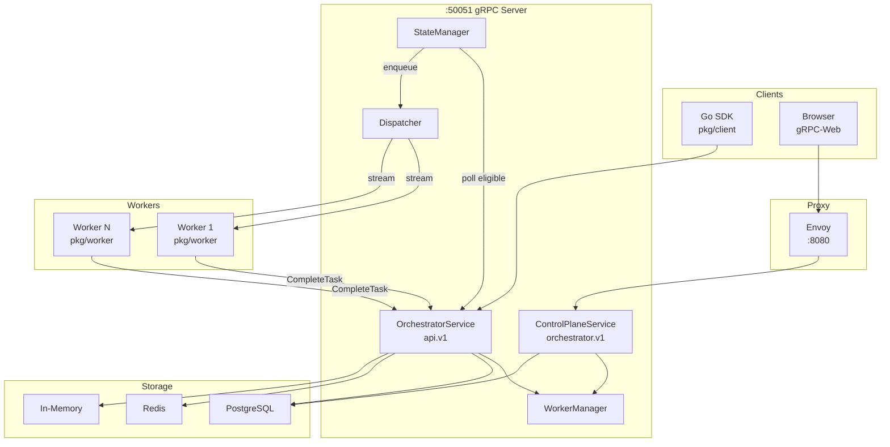
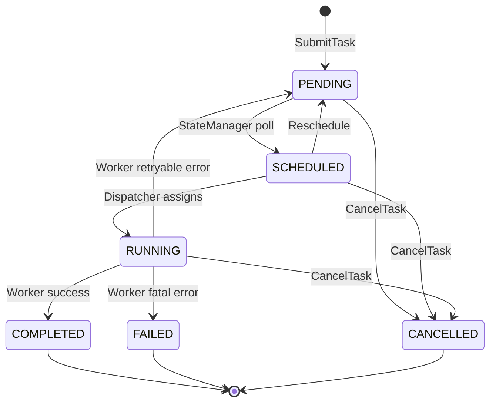
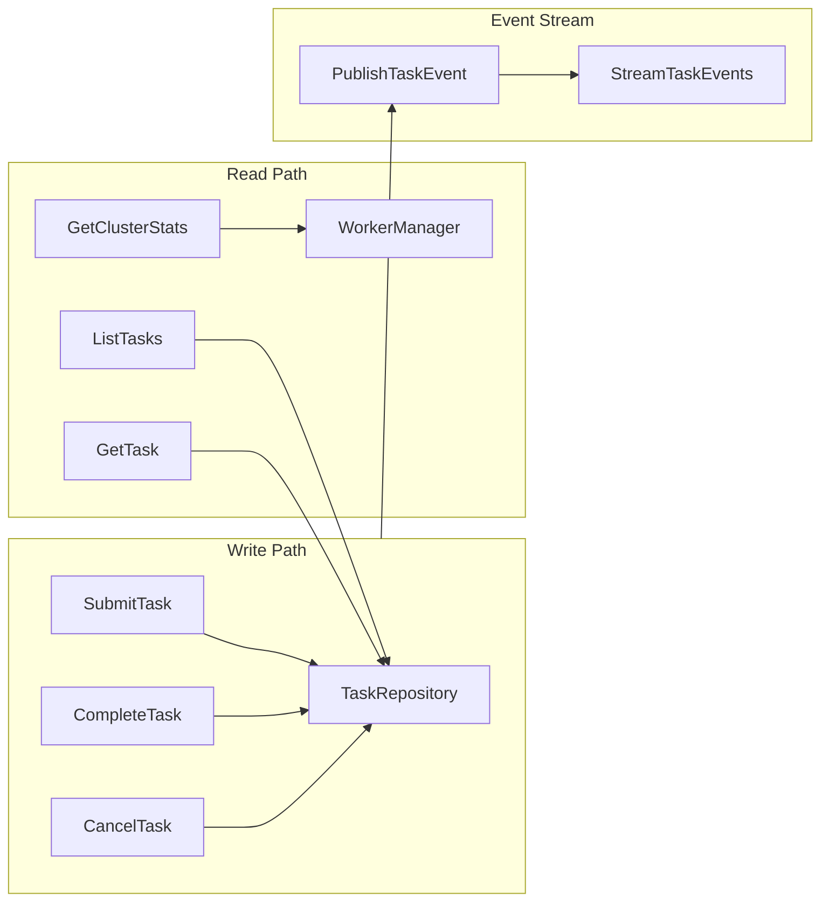

# System Architecture

## High-Level Overview



## Task Lifecycle (State Machine)



## Data Flow (CQRS)



## Directory Structure

```
task-orchestrator/
├── api/proto/                  # Protobuf definitions
│   ├── v1/orchestrator.proto   # Worker-plane API
│   └── orchestrator/v1/        # Control-plane API
├── cmd/
│   ├── server/                 # Server entrypoint
│   ├── worker/                 # Worker entrypoint (uses pkg/worker)
│   ├── client/                 # Test utilities (uses pkg/client)
│   ├── migrate/                # DB migration tool
│   └── seed/                   # Sample data seeder
├── deploy/envoy/               # Envoy proxy config
├── internal/
│   ├── domain/                 # Task, TaskState, errors
│   ├── port/                   # TaskRepository, Logger interfaces
│   ├── adapter/                # Implementations (postgres, redis, memory, zap)
│   └── service/                # Orchestrator, ControlPlane, Dispatcher, StateManager
├── pkg/
│   ├── api/                    # Generated protobuf Go code
│   ├── worker/                 # Embeddable worker library
│   └── client/                 # Go SDK
└── explainer/                  # Phase-by-phase design docs
```
